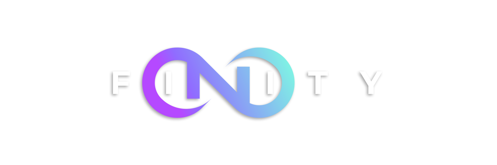

  

<h4 align="center">
  <a href="https://nxfinity.live">Rethinking, Remodeling and Recreating Decentralised Technology</a>
</h4>

[NXF WHITEPAPER](https://github.com/NXFinity/NXF/wiki)

<h2 align="left">
  Network X Framework
</h2>

  Network X Framework (NXF): An open-source framework for building decentralized applications, powered by Node.js, Nest.js, Angular, and Typescript, designed to promote a self-autonomous digital community

<h2 align="left">
  Vision Statement
</h2>

To revolutionize digital communities, create self-autonomous systems, and redefine the boundaries of technology through 
decentralized applications. We envisage a world where technology empowers individuals, fosters equality, and promotes a global sense of community

<h2 align="left">
  Mission Statement
</h2>

Network X Framework (NXF) is committed to developing a robust, open-source, decentralized platform using cutting-edge technologies like Node.js, Nest.js, 
Angular, and Typescript. Our mission is to empower individuals and communities by providing them with the tools to create and manage their digital 
interactions in a secure, private, and democratic environment. We aim to innovate and push the boundaries of what is possible in the realm of decentralized 
technology, fostering a culture of continuous learning, growth, and collaboration.

